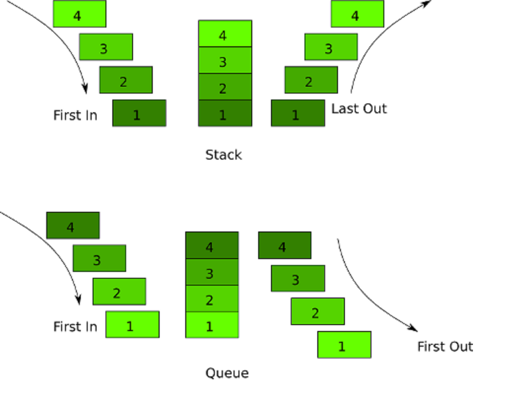

# DSA Workshop (Stack and Queue)

## Stack

Stack is a **LIFO** (last in first out) data structure.

### Real life stacks

- A stack of dishes
- A pile of t-shirts

### Some practical use-cases of a stack:

- Reversing order
- "Undo" functionality
- Several important algorithms (like DFS)
- The call stack - keeping track of currently active methods

### Common operations on a stack

- `Push(element)` - add an element to the stack
- `Pop()` - remove an element from the top of the stack
- `Peek()` - get the value of the first element, without removing it

## Queue

Queue is a **FIFO** (first in first out) data structure.

### Some practical use-cases of a queue:

- Breadth-First Search in a tree/graph
- In a call center - to manage the people who need to be helped
- Printing documents - the printer can only print one at a time, the others are next in line (First in, first out)

### Common operations on a queue

- `Enqueue(element)` - adding an element to the queue
- `Dequeue()`  - removing an element from the queue
- `Peek()` - get the value of the first element, without removing it

## Stack vs Queue

## Task

Your task is to implement a stack and a queue, using the template provided.

### Guidelines:

1. Implement all methods from the `IStack` and `IQueue` interfaces.
1. You can use either array or linked implementation using a `Node` class.
   - Start with ArrayStack, then LinkedStack.
   - Continue with LinkedQueue.
   - ArrayQueue has two different implementations
      - Enqueue from left to right in the array; Dequeue by shifting elements to the left (O(n)).
      - **[Advanced]** Circular implementation - Dequeue doesn't shift elements(O(1)).
   - You are not allowed to use `List` and `LinkedList` classes.
   - There is a sample `Node` class in the template.
1. All tests should pass.
   - Select the correct implementation in the tests class.

## Practice

### Tasks that use stack and queue:

 - [Valid Parentheses](https://leetcode.com/problems/valid-parentheses/)
 - [Backspace String Compare](https://leetcode.com/problems/backspace-string-compare/)
 - [Baseball Game](https://leetcode.com/problems/baseball-game/)
 - [Asteroid Collision](https://leetcode.com/problems/asteroid-collision/)
