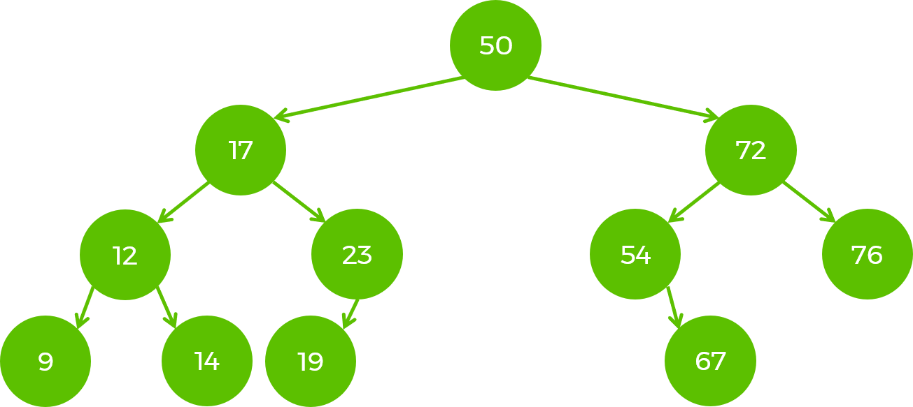

# DSA Workshop (Binary Search Tree)

A binary search tree (BST), is a binary tree where for each node the left sub-tree contains only nodes with values less than the parent node; the right sub-tree contains only nodes with values greater than the parent node. 

## Balanced binary search tree:

A BST is **balanced** when for each node X the difference in height of the left and the right sub-trees is <= 1. Balanced tree is special BST that is optimized for searching, inserting and deleting which are done with `O(logn)`.

*Note: If binary search tree is **not** balanced then the complexity in the worst case scenario of its operations is O(n).*

## Balanced tree example:

## Common operations and their time complexities (in a balanced tree):

- Insert new node: `O(logn)`
- Search: `O(logn)`
- Remove a node: `O(logn)`

## Binary search tree practical use-cases:

- Have a sorted list of values where you can quickly add elements and still have them sorted (Consider using an array for this purpose. You have very fast access to read random values, but if you want to add a new value, you have to find the place in the array where it belongs, shift everything over, and then insert the new value);
- Maintaining a dynamically changing dataset in sorted order, for some "sortable / comparable" type;
- Implementing sorted sets & maps in core language libraries (SortedSet/SortedDictionary in C#);

## Task

Your task is to implement a binary search tree (**not balanced**), using the template provided.

*Note: Implementing a balanced tree is not trivial. Popular implementations are Red-Black Tree and AVL Tree.*

### Before you begin:

- Get a better understanding of trees by playing around in [Visualgo](https://visualgo.net/en/bst);
- Draw a BST. Think about the algorithms to insert and find a node. What about deleting? How would you implement removing a node;

### Steps:

1. Implement all methods from the *IBinarySearchTree* interface.
2. Implement 2 constructors.
3. All tests should pass.

## Practice

- [Minimum Absolute Difference in BST](https://leetcode.com/problems/minimum-absolute-difference-in-bst/)  
- [Longest Univalue Path](https://leetcode.com/problems/longest-univalue-path/description/)  
- [Binary Tree Paths](https://leetcode.com/problems/binary-tree-paths/description/)  
- [More](https://leetcode.com/problemset/all/?search=bst)

### Advanced task

- Implement remove method. There are unit tests for it.

*Note: When implementing remove of element that has both left and right children, tests are meant to cover implementation that chooses to change the left sub-tree.*