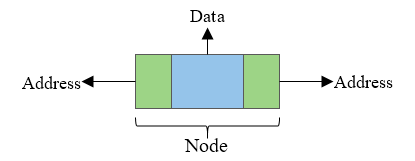
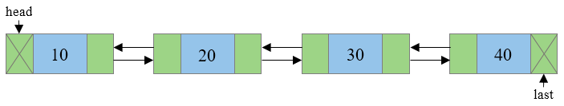

# DSA Workshop (Doubly Linked List)

## Description

A doubly-linked list is a linear data structure, in which each node stores:

- A link (reference) to the previous node
- The element (value)
- A link (reference) to the next node

A doubly-linked list is used in many practical cases, where navigation in both ways is required, such as:

- Web pages forward and backward navigation
- Undo and redo functionality in many applications
- In gaming, to represent various states of the game

## And more

In most programming interviews, linked list themed tasks are given in order to test the ability of the candidate to **maintain and update references**. The LinkedList methods `add/insert` and `remove` are excellent tasks to practice your skills with references.

### A node in a doubly-linked list:

### Example of doubly-linked list:

Note that the **head** (the first element in the list) stores a null reference. On the other hand, the **tail** (the last element) does not have an element after itself.

### Common operations on a doubly-linked list and their time complexities:
|Operation | Complexity |
|----------|:----------:|
| Add a new head/tail | O(1) |
| Removing/retrieving the value of the head/tail | O(1) |
| Adding/removing elements that are not in the beginning/end | O(n)   (since we do not have a direct reference and we need to traverse the whole list in the worst case) |
| Finding/Searching | O(n) |
| Insert before/after a specific node | O(1)  (if we have the reference, but most often we do have to perform a search first to retrieve it) |

## Task

Your task is to implement a doubly-linked list, using the template provided.

### Guidelines:

- Play around in [https://visualgo.net/en/list](https://visualgo.net/en/list) (choose the DLL option from the top menu)
- Have a pen and paper draw a doubly-linked list. How would you remove or add a node in the middle? What references must be changed and in what order?

### Steps

1. Implement all methods from the `IList` interface. Note that you are provided with `Node` implementation that you can not modify.
1. Unit tests will help you to trach your progress.
1. Now solve a few tasks!

## Practice

### Coding tasks for additional practice:

- [Middle of the Linked List](https://leetcode.com/problems/middle-of-the-linked-list/description/)
- [Merge Two Sorted Lists](https://leetcode.com/problems/merge-two-sorted-lists/)
- [Reverse Linked Lists](https://leetcode.com/problems/reverse-linked-list/description/)
- [Palindrome Linked List](https://leetcode.com/problems/palindrome-linked-list/)
- [Remove Linked List Elements](https://leetcode.com/problems/remove-linked-list-elements/description/)
- [Remove Duplicates from Sorted List](https://leetcode.com/problems/remove-duplicates-from-sorted-list/)
